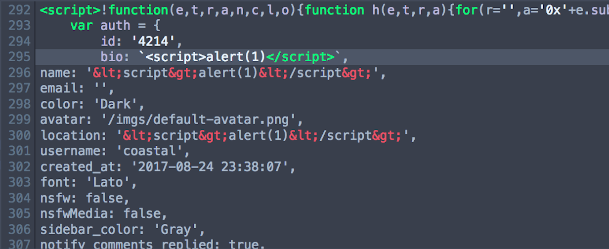
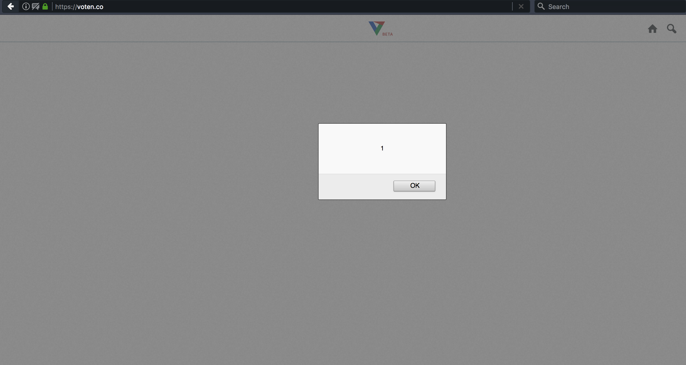
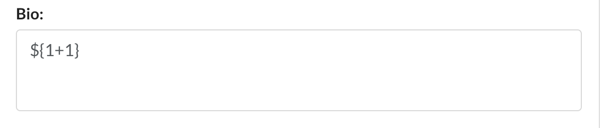
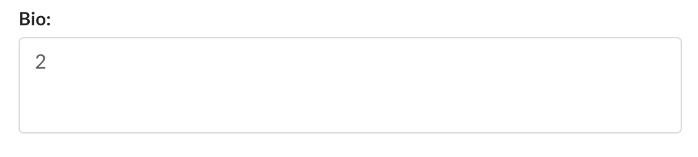
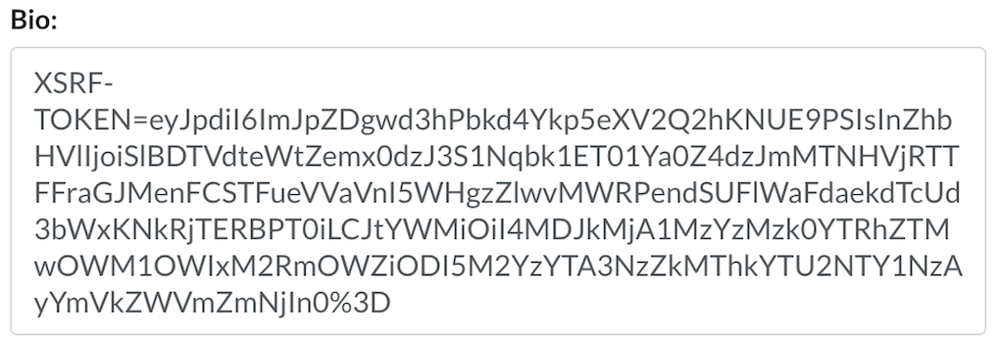

# CVE-2018-7663

### [Description]

An issue was discovered in resources/views/layouts/app.blade.php in Voten.co before 2017-08-25. An unescaped template literal in the bio field of a user profile (resources/views/layouts/app.blade.php) allows for stored XSS. 

[MITRE Full CVE Description](https://cve.mitre.org/cgi-bin/cvename.cgi?name=CVE-2018-7663)

[NIST NVD Reference](https://nvd.nist.gov/vuln/detail/CVE-2018-7663)

### Writeup

This vuln came about back in summer 2017 when there was talk of viable reddit alternatives, as happens at least anually on reddit. One site that was posted, [voten.co](https://www.voten.co) got a decent amount of attention on [some posts](https://www.reddit.com/r/programming/comments/6vqjwy/the_code_that_powers_voten_an_opensource_realtime/). Social media sites seem to be notoriously complex with a relatively large attack surface, so I decided to take a peek at the site and see if I could fuzz out some vulns.

The first thing I did was check the user profile. I figured that posts and comments will likely be locked down, but values that need to be set behind an authentication mechanism might be more likely to have relaxed settings on what can or cannot be modified, or might not have been thought about as a premier attack surface. So, relatively simply, I set the value of each field in my profile to `<script>alert(1)</script>`.



Almost all of the fields seemed to filter properly on the `<` and `>` characters, encoding to `&lt` and `&gt` respectively. However, one field (`bio`) seemed to fail to filter. And when we navigated to the page displaying the bio information:



Interestingly, this vulnerability actually came about due to the use of template literals. If we look back at the discovery photo, we see that the value of `bio` is surrounded by backticks. These are how template literals are formatted. Template literals are a JavaScript convention that allows for the use of dynamic strings. These strings can access arbitrary variable values and execute arbitrary JavaScript code through the expression format `${variable}`. Here, we can see an example of using this functionality to execute arbitrary JavaScript:





Now, we can use this arbitrary JavaScript execution to perform a number of attacks including XSS or token-grabbing by embedding the payload in the `bio` field. When the profile is visited:



Additionally, I found that you can escape the template literal with a payload like so:

```
`}</p><script>alert(1)</script><script>alert(1)</script>
```

The second `<script>` block is the one that is executed.

One limitation of this vulnerability is that it is triggered only when visiting the user's settings page. This means it is accessible / modifiable only by the user. This would likely classify this vulnerability as a "Self-XSS" as opposed to a more traditional XSS.

### Addendum

Since the page we can inject to is actually a template that compiles to `php` (with our injected value), arbitrary OS code execution may be possible through native `php` code. I didn't explore this further unfortunately, but as the second tag appended on this payload doesn't necessarily have to be JavaScript it would seem possible that a payload like:

```
`}</p><script>alert(1)</script><?php echo shell_exec('echo pwnd');?>
```

could achieve arbitrary code execution. Another possibility is that we may be able to perform a template injection and execute arbitrary `php` with the Laravel framework's templating system like so:

```
@php
    //
@endphp
```

or `@{ arbitrary_php_here }}` or `{{--*/ arbitrary_php_here /*--}}`, which all compile to `<?php arbitrary_php_here ?>`. However, this would require that the injection and/or field escape would occur at compilation time as opposed to page load time (which I am not sure is the case).

I may build the app from the vulnerable source version on Ubuntu 16.04 LTS and see if I can make one of these extensions of the attack work, as that would take this from XSS to RCE!

**Resources**


